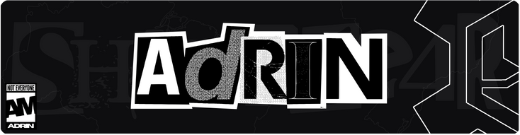

  <h1>Adrian M Barbosa</h1>
  
Systems Analist and Developer by SENAI (Brazilian National Service for Industrial Training) | Fullstack  Developer

<h2 align="left">🦾 Skills</h2>

###

  
  
  
  
  
  
  
  
  
  
  
  
  
  
  
  
  
  
  
  
  
  
  

